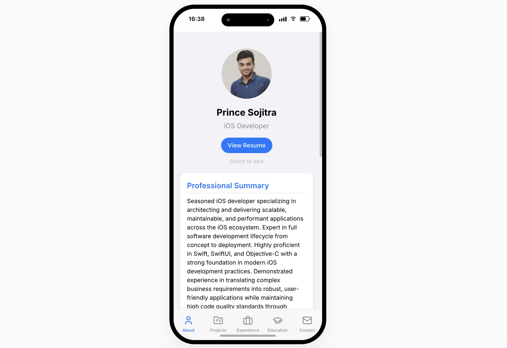

# iOS Portfolio Template

A modern, responsive portfolio website that mimics an iOS mobile interface to showcase your professional experience in a unique way.

**[Live Demo](https://princesojitra.github.io)** - Check out the live preview!



## Features

- 📱 Realistic iOS interface with dynamic island, status bar, and home indicator.
- 🌙 Dark/light mode support.
- 📊 Fully responsive design (displays as an iPhone on desktop, native app on mobile).
- 🧩 Tabbed navigation (About, Projects, Experience, Education, Contact).
- 📝 PDF Resume generation.
- 🖼️ Project showcase with image carousels.
- ⚡ Built with React, TypeScript, and Vite.
- 🚀 Easy deployment to GitHub Pages.

## Getting Started

### Prerequisites

- Node.js (version 14 or higher)
- npm or yarn

### Installation

1. Clone this repository:
   ```bash
   git clone https://github.com/yourusername/ios-portfolio.git
   cd ios-portfolio
   ```

2. Install dependencies:
   ```bash
   npm install
   # or
   yarn install
   ```

3. Start the development server:
   ```bash
   npm run dev
   # or
   yarn dev
   ```

## Customizing Your Portfolio

### Edit Your Information

All of your personal information is stored in a single file: `src/resume.json`. Update this file with your details:

- Basic information (name, title, contact info)
- Skills and languages
- Work experience
- Education history
- Projects (with screenshots)

Example structure:

```json
{
  "basics": {
    "name": "Your Name",
    "title": "Your Title",
    "image": "./assets/images/your-profile.jpeg",
    "email": "your.email@example.com",
    "phone": "+1234567890",
    "location": "Your Location",
    "profiles": [
      {
        "network": "LinkedIn",
        "username": "yourusername",
        "url": "https://linkedin.com/in/yourusername"
      },
      {
        "network": "GitHub",
        "username": "yourusername",
        "url": "https://github.com/yourusername"
      }
    ]
  },
  "summary": "Your professional summary...",
  
  // Other sections...
}
```

### Adding Project Screenshots

1. Place your project screenshots in `src/assets/projects/[project-folder-name]/`
2. Update the `screenshots` array in the project entry in `resume.json`

### Customizing Appearance

- Edit theme colors in `src/styles/App.css`
- Modify components in `src/components/` directory

## Deployment

This project is configured to automatically deploy to GitHub Pages.

### Setup GitHub Pages

1. Push your changes to GitHub
2. Go to your repository settings
3. Navigate to "Pages"
4. Set "Source" to "GitHub Actions"
5. Optionally add a custom domain

The site is configured to work at any path level:
- Root domain (e.g., `https://example.com/`)
- Subdirectory (e.g., `https://example.com/portfolio/`)
- Custom domain or GitHub Pages domain

## Manual Deployment

To manually trigger a deployment:

1. Go to your GitHub repository
2. Navigate to Actions
3. Select "Deploy to GitHub Pages" workflow
4. Click "Run workflow"

## License

This project is licensed under the MIT License - see the LICENSE file for details.

## Acknowledgments

- Icons: [React Icons](https://react-icons.github.io/react-icons/)
- Router: [React Router](https://reactrouter.com/)
- PDF Generation: [React-PDF](https://react-pdf.org/) 
